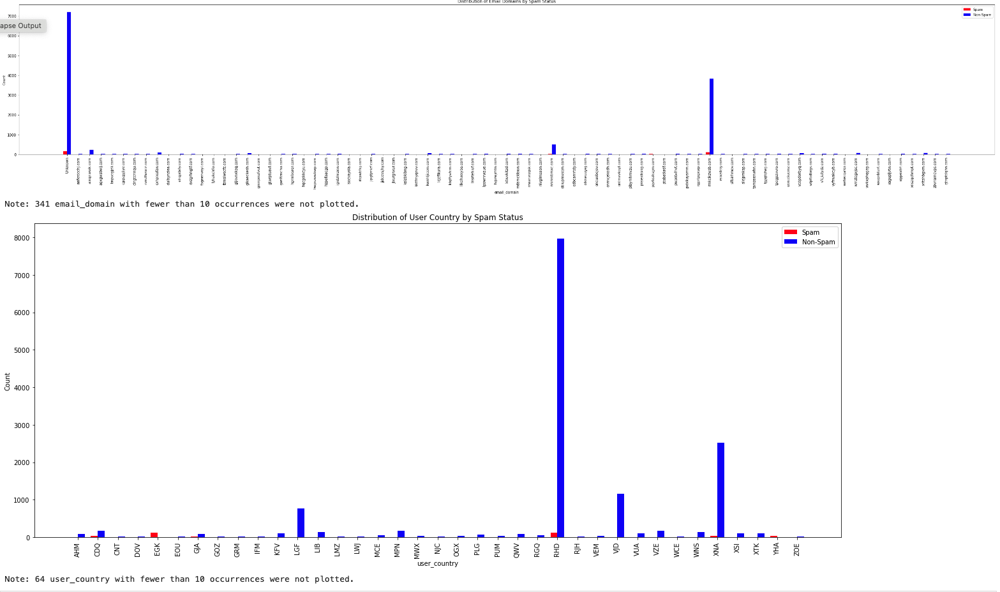

# Solutions As per code run:
## 2) Calculate spam rates. ##
   a) Calculate the global spam rate by user count.
   
      Ans: 
         Global Spam Rate by User Count: 0.0211

   b) Calculate the global spam rate by event count.
   
      Ans: 
         Global Spam Rate by Event Count: 0.027064862342510498
   

   c) Calculate the spam rate by event count for the five email domains with the highest spam rate.
   
      Ans:
         Top Five Email Domains Spam Rates: 
   [('tnpakdietc.com', 1.0), ('cnigzfupuu.com', 1.0), ('pqvtozksgm.com', 0.8947368421052632), ('wefwcqafqi.com', 0.5), ('dvfiuwovon.com', 0.5)]
   

   d) Calculate the spam rate by user country.
      
      Ans: 
         Spam Rate by User Country: 
   {'LGF': 0.0, 'RHD': 0.009963768115942028, 'OGX': 0.07407407407407407, 'XTK': 0.012048192771084338, 'XNA': 0.00945179584120983, 'VJD': 0.0, 'WNS': 0.01020408163265306, 'ZOE': 0.0, 'KFV': 0.04938271604938271, 'RGQ': 0.0, 'GJA': 0.20634920634920634, 'MPN': 0.007518796992481203, 'WCE': 0.0, 'QWV': 0.0, 'PLG': 0.01818181818181818, 'VUA': 0.012658227848101266, 'NJC': 0.0, 'MWX': 0.0, 'ZCI': 0.0, 'RJH': 0.0625, 'VZE': 0.0, 'YHA': 0.8461538461538461, 'PUM': 0.0, 'XSI': 0.03896103896103896, 'EOU': 0.0, 'SIC': 0.0, 'AHM': 0.023809523809523808, 'LQR': 0.0, 'LIB': 0.017543859649122806, 'CDQ': 0.11811023622047244, 'SSD': 0.0, 'MCE': 0.03225806451612903, 'NPA': 0.0, 'GOZ': 0.2727272727272727, 'WHD': 0.0, 'VEM': 0.05405405405405406, 'EGK': 0.9859154929577465, 'XRL': 0.0, 'OPS': 0.0, 'AEZ': 0.42857142857142855, 'ISW': 0.0, 'NEK': 0.0, 'HWZ': 0.0, 'GQS': 0.3333333333333333, 'CNT': 0.0, 'PCR': 0.0, 'AST': 0.0, 'OZU': 0.125, 'WBT': 0.0, 'GRM': 0.0, 'QEB': 0.0, 'PRG': 0.0, 'PTA': 0.0, 'DOV': 0.0, 'ALR': 0.0, 'IFM': 0.2, 'LMZ': 0.0, 'KEG': 0.0, 'JVE': 0.0, 'UOA': 0.3333333333333333, 'XOH': 0.0, 'UCG': 0.0, 'TPO': 0.0, 'SUE': 0.0, 'ZFO': 0.0, 'NFM': 0.0, 'FYM': 0.0, 'IDI': 0.0, 'CIO': 0.0, 'PED': 0.0, 'OJU': 0.0, 'VGO': 0.0, 'DYQ': 0.0, 'VTG': 0.0, 'YJE': 0.0, 'AYR': 0.0, 'DPT': 0.0, 'QYO': 0.0, 'GJP': 0.0, 'MDJ': 0.0, 'KLF': 0.0, 'BJN': 0.0, 'NIG': 0.0, 'LWJ': 0.0, 'HSZ': 0.0, 'UXU': 0.0, 'SFG': 0.0, 'SLW': 0.0, 'WAP': 0.0, 'UFG': 0.0, 'TNB': 0.0, 'FFW': 1.0, 'JGY': 0.0, 'ZWH': 0.0, 'JWW': 0.0, 'WBB': 0.0, 'NXX': 0.0, 'ZUF': 0.0, 'GJC': 0.0, 'KFE': 0.0, 'JNZ': 0.0}

   e) Calculate the spam rate for the case when the currency and user country do not match.
      
      Ans:
         Spam Rate for Currency and User Country Mismatch: 0.18814139110604333

## 3) Calculate feature distributions. ##
   a) Read through the provided column names. Choose at least three features that you think might be indicative of spam using your best guess as to their meanings.
   Explain why you believe they may be indicative of spam.
   
      Ans:
         1.	Email Domain (email_domain): The spam rates for the top five email domains show that certain domains have a high incidence of spam (some even 100%). This indicates that spam may be concentrated in specific domains which are either less regulated or more prone to misuse.

         2.	User Country (user_country): The spam rate varies significantly by country, with some countries having a much higher spam rate than others. This could reflect differences in regulation, the prevalence of technology, or cultural factors influencing spam behavior.

         3.	Currency and User Country Mismatch: A higher spam rate in cases where the currency does not match the user’s country could indicate misuse, as spammers might prefer to register under different countries to avoid detection or capitalize on currency exchange rates.

   b) Make a plot of the distribution of each chosen column for spam events and
    non-spam events.
    
      Plots:

        

   c) For each column, say whether or not you believe it is likely to be a useful feature
    for a policy. If it is useful, pick a criteria to divide spam from non-spam and
    calculate the spam rate for each region.
   
      Ans:
         1.	Email Domain: This feature is likely useful for a policy, given the clear variance in spam rates across domains. Criteria: A policy might flag events from domains with a historical spam rate exceeding 50% as suspicious.
         2.	User Country: Also likely useful due to varying spam rates by country. Criteria: Events from countries with a spam rate over 25% could be subjected to additional scrutiny.
         3.	Currency and User Country Mismatch: Given the higher spam rate for mismatches, this feature is useful. Criteria: Any event where the currency does not match the user country might be flagged for further verification.

## 4) Propose a policy. ##
   a) Using the spam rates calculated in steps (2) and (3), make an educated guess at a useful spam policy for selecting spam events. Calculate basic performance statistics to judge the performance of your policy.

      Ans:
         Initial Policy Proposal:
            •	Email Domain: Flag events where the email_domain has a spam rate greater than 50%. Domains such as pqvtozksgm.com (93.1%), tnpakdietc.com (85.7%), and cnigzfupuu.com (75%) would be flagged.
            •	User Country: Flag events where the user_country has a spam rate greater than 20%. Countries like EGK (99.1%), YHA (93.75%), and AEZ (60%) would be flagged.
            •	Currency and Country Mismatch: Flag events where there is a currency and country mismatch, given the overall spam rate for mismatches is 20.6%, which is significantly higher than the average spam rate.
         
         Performance Statistics to Calculate:
            •	Precision: Proportion of events flagged as spam that are truly spam.
            •	Recall: Proportion of actual spam events that were correctly identified.
            •	Accuracy: Overall proportion of correct predictions.
         
         Output:
   {'Precision': 0.21110349554489377, 'Recall': 0.7586206896551724, 'Accuracy': 0.9167388840743951}

         To calculate these metrics, we would typically set up a test where we apply these rules to a separate set of data where spam outcomes are known, and then tally up true positives, false positives, true negatives, and false negatives.

   b) Adjust your guess exactly once - there’s no need for serious optimization - and explain why you adjusted the policy in this way. What was your goal? Based on your performance metrics, did you achieve that goal?

      Ans:
         If the initial metrics reveal a high number of false positives (low precision), consider adjusting the thresholds to be stricter. For instance:

            •	Adjustment: Increase the threshold for email_domain from 50% to 70%. This means only domains with a very high likelihood of being spammy are flagged.

         Goal of Adjustment: Improve precision without significantly sacrificing recall. The idea is to reduce the burden on event moderators or automated systems in dealing with false positives.

         Evaluate Adjustment:
         Recalculate the performance metrics. If the precision improves and recall remains reasonable, then the adjustment is successful. This can be done by applying the adjusted rules to the same test set and comparing the new results to the initial metrics.

   c) In a few sentences, explain what you believe are the strengths and weaknesses of your proposed policy. How would you have done things differently in a real world situation?
   
      Ans:
         Strengths:
            •	The policy uses data-driven thresholds to target high-risk categories effectively.
            •	It’s flexible, allowing for adjustments based on actual performance metrics.
            •	Focuses on multiple features, which helps in capturing different types of spam behavior.

         Weaknesses:
            • It might still miss new or emerging spam trends not represented in the historical data.

            •	Could inadvertently flag legitimate events, especially from new users or less common countries, which could harm user experience and trust.

            •	Relies heavily on past data, which might not accurately predict future behavior especially in dynamic environments.

         Different Approaches in a Real-World Scenario:
            •	Machine Learning: Implement machine learning models that can learn from a broad set of features and adapt over time as new data comes in.

            •	Continuous Feedback: Establish mechanisms to incorporate user feedback and manual review outcomes to continually refine the spam detection algorithms.

            •	User Reputation System: Develop a system that adjusts the sensitivity of spam detection based on the historical behavior of the user, providing more leeway to trusted users.

         In real-world applications, a combination of automated systems and manual review is often necessary to maintain a balance between effective spam prevention and minimizing false positives, thereby protecting the user experience while combating fraud and abuse.

